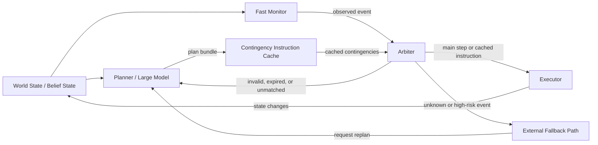

# Conceptual Components

This diagram gives context for the Contingency Instruction Cache (CIC) design note. It is not a reference architecture or a complete agent stack. The components only show where a plan bundle and its cached contingencies could sit between planning and execution.

## Modules

### World State / Belief State

Supplies the current, possibly uncertain summary of the environment. CIC consumes this state but does not build or validate it.

### Planner / Large Model

Produces a plan bundle: a short main plan, a small number of cached contingencies, and `replan_if` conditions.

### Contingency Instruction Cache

Stores the current plan bundle. Each cached contingency has a `trigger`, instruction, `valid_if`, expiration time, priority, and fallback. CIC does not decide whether the underlying world state is correct.

### Fast Monitor

Receives state updates and evaluates cached triggers without requesting a fresh plan. CIC does not define the perception or observation system that produces those updates.

### Arbiter

Chooses between continuing the main plan, using a currently applicable cached contingency, routing to an external fallback path, or requesting replanning. It rejects a cached contingency when its `trigger` does not match, its `valid_if` condition does not hold, or it has expired.

### Executor

Carries out main-plan steps or cached instructions through an external action interface. CIC does not define low-level control.

### External Fallback Path

Represents a conservative external path for unknown or high-risk events before replanning. It must be independent of CIC. Its presence does not make a cached instruction safe or provide a safety guarantee.

## Data Flow

## Decision Order

For each relevant event, the arbiter could apply the following order:

1. defer to external constraints or risk controls;
2. evaluate high-risk `replan_if` conditions and route to the external fallback path when needed;
3. reject expired or invalid cached contingencies;
4. choose the highest-priority cached contingency whose `trigger` matches;
5. use its instruction only when `valid_if` holds; or
6. request replanning for an invalid cache or an unknown or unmatched event.

This ordering is illustrative. CIC does not specify the risk-control policy, monitor implementation, planner, or executor.
