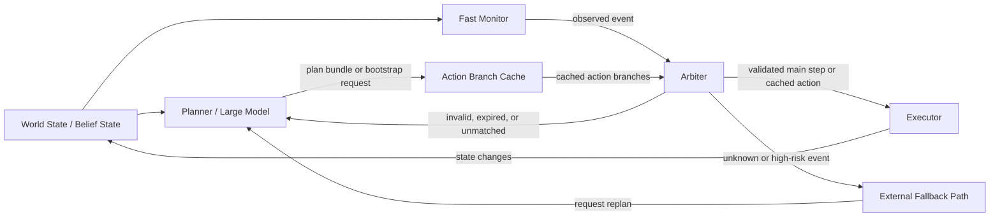

# Conceptual Components

This diagram gives context for the Action Branch Cache (ABC) design note. It is not a reference architecture or a complete agent stack. The components only show where a plan bundle and its cached action branches could sit between planning and execution.

## Modules

### World State / Belief State

Supplies the current, possibly uncertain summary of the environment. ABC consumes this state but does not build or validate it.

### Planner / Large Model

Produces a plan bundle. In hydrated mode, this includes a short main plan, a small number of cached action branches, and `replan_if` conditions. In progressive mode, it may first produce only a `bootstrap_action` and an `async_branch_request`.

### Action Branch Cache

Stores the current plan bundle. Each hydrated cached action branch has a `condition`, structured `trigger`, structured `action`, `valid_if`, expiration time, priority, and fallback. ABC does not decide whether the underlying world state is correct.

### Fast Monitor

Receives state updates and evaluates cached triggers without requesting a fresh plan. In an integrated system, the monitor would map `trigger.detector`, `trigger.signals`, and `trigger.rule` to external detection logic. ABC does not define the perception or observation system that produces those updates.

### Arbiter

Chooses between continuing the main plan, considering a currently applicable cached action branch, routing to an external fallback path, or requesting replanning. It rejects a branch when its `trigger` does not match, its `valid_if` condition does not hold, or it has expired.

### Executor

Carries out main-plan steps, bootstrap actions, or cached actions through an external action interface. In an integrated system, `action.command`, `action.args`, and `action.executor` would be mapped to external skills, tools, or controllers. ABC does not define low-level control or bypass action validation.

### External Fallback Path

Represents a conservative external path for unknown or high-risk events before replanning. It must be independent of ABC. Its presence does not make a cached action safe or provide a safety guarantee.

## Data Flow

## Decision Order

For each relevant event, the arbiter could apply the following order:

1. defer to external constraints or risk controls;
2. evaluate high-risk `replan_if` conditions and route to the external fallback path when needed;
3. reject expired or invalid cached action branches;
4. choose the highest-priority branch whose `trigger` matches;
5. pass its action through external validation only when `valid_if` holds; or
6. request replanning for an invalid cache or an unknown or unmatched event.

This ordering is illustrative. ABC does not specify the risk-control policy, monitor implementation, planner, action validator, or executor.
